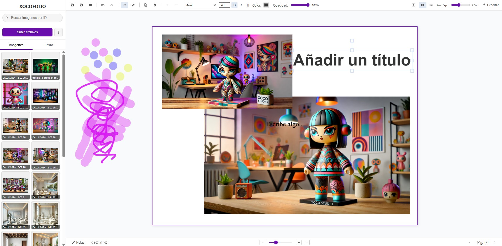

# Guía de Uso del Editor de Imágenes Avanzado (Multi-Página)

## Acceso Rápido a la Aplicación
[XOCOFOLIO - Demo en vivo](https://xococode.github.io/xocofolio/)

Este editor basado en Fabric.js está diseñado para crear y editar diseños de varias páginas de forma intuitiva. A continuación encontrarás las principales áreas y funcionalidades desde el punto de vista del usuario.

---

## 1. Interfaz General

- **Diseño de paneles**  
  - **Barra lateral izquierda**: carga y gestión de recursos (imágenes y estilos de texto).  
  - **Contenido principal**: lienzo multi-página interactivo.  
  - **Barra de herramientas superior**: acceso rápido a acciones globales y de objeto.  
  - **Barra inferior**: notas, coordenadas de objeto y navegación/zoom de páginas.

---

## 2. Barra Lateral

1. **Logo y nombre**  
   En la parte superior, enlace a XOCOFOLIO.

2. **Carga y búsqueda de imágenes**  
   - Botón **“Subir archivos”**: importa imágenes locales (múltiples a la vez).  
   - Campo de búsqueda por **ID**: filtra imágenes ya cargadas usando su identificador.

3. **Pestañas**  
   - **Imágenes**: vista en cuadrícula de todas las imágenes cargadas.  
   - **Texto**: plantillas de texto prediseñadas (título, subtítulo, cuerpo) que puedes arrastrar o hacer clic para añadir.

---

## 3. Barra de Herramientas Superior

### 3.1 Acciones de Proyecto

- **Guardar Proyecto (Ctrl+S)**: descarga un archivo `.canvaedit` con todo el estado (lienzo, páginas, imágenes, notas).  
- **Guardar Como…**: elige nombre de archivo.  
- **Cargar Proyecto**: importa un archivo `.canvaedit` para reanudar el trabajo.

### 3.2 Deshacer/Rehacer

- **Deshacer (Ctrl+Z)** y **Rehacer (Ctrl+Y)**: historial ilimitado mientras la sesión esté activa.

### 3.3 Herramientas de Creación

- **Añadir Texto Personalizado**: inserta un cuadro de texto editable (“Escribe algo…”).  
- **Modo Dibujo**: traza a mano alzada sobre el lienzo con pincel personalizable.

### 3.4 Gestión de Páginas

- **Añadir Nueva Página**: crea hasta 3 páginas en un mismo proyecto.  
- **Eliminar Página Activa**: borra la página y todo su contenido.  
- **Mostrar/Ocultar Página**: activa/desactiva la visibilidad de cada página (y su contenido).  
- **Tamaño de Página**: alterna campos W/H para ajustar las dimensiones de la página activa.

### 3.5 Exportación

Al pulsar **Exportar** se despliega un menú con las opciones:
- **Página Activa**: PNG / JPG / PDF.  
- **Todas las Páginas**: ZIP con PNG/JPG o un PDF multi-página.  
- **Resolución de Exportación**: slider para definir hasta 5× la escala.

---

## 4. Área de Lienzo (Canvas)

- **Lienzo Multi-Página**  
  Cada página es un rectángulo blanco sobre fondo cuadriculado. Selecciona la activa con un borde morado.

- **Arrastrar y Soltar**  
  - Imágenes: arrastra desde la barra lateral hasta cualquier punto del lienzo.  
  - Texto predefinido: idem.

- **Selección y Transformación**  
  - Haz clic para seleccionar objetos (imágenes, texto, trazos).  
  - Controladores para mover, escalar, rotar.  
  - Doble clic en texto para editarlo.

---

## 5. Controles Contextuales

- **Barra de acciones de objeto** (flotante encima del objeto seleccionado):  
  - **Bloquear/Desbloquear**  
  - **Duplicar**  
  - **Eliminar**  
  - **Más opciones** (menú contextual con capas y orden Z).

- **Controles de Texto** (aparecen al editar texto):  
  - Fuente, tamaño, negrita, cursiva, subrayado, color.  
  - Opacidad individual.

- **Controles de Dibujo**:  
  - Color y grosor de pincel.  
  - Opacidad.

- **Control de Opacidad**: al seleccionar cualquier objeto (no página), ajusta su transparencia.

---

## 6. Barra Inferior

- **Notas**: abre un modal para escribir y guardar anotaciones locales.  
- **Coordenadas**: muestra la posición X/Y relativa dentro de la página activa para el objeto seleccionado.  
- **Zoom y Navegación**  
  - Slider y botones ± para acercar/alejar.  
  - “Ajustar a pantalla” centra y ajusta zoom automáticamente.  
  - Páginas anterior/siguiente: moverte entre ellas y ver el indicador “Pág. X/Y”.

---

## 7. Zoom y Paneo

- **Zoom con rueda del ratón**  
  Gira la rueda del ratón mientras el cursor está sobre el lienzo para acercar o alejar, centrado en la posición del cursor.

- **Paneo**  
  Mantén pulsada la tecla **Alt** y arrastra con el **botón izquierdo** del ratón para desplazar el lienzo libremente en cualquier dirección.

---

## 8. Panel de Capas

- Se abre desde el icono “Posición (Capas)” en la barra superior.  
- Lista de todos los objetos de la página activa (sin incluir la forma de página).  
- Permite:  
  - Seleccionar capa  
  - Mostrar/Ocultar  
  - Mover hacia arriba/abajo en el orden Z  
  - Eliminar

---

## 9. Atajos de Teclado

| Acción                | Atajo                |
| --------------------- | -------------------- |
| Guardar Proyecto      | Ctrl / ⌘ + S         |
| Deshacer              | Ctrl / ⌘ + Z         |
| Rehacer               | Ctrl / ⌘ + Y         |
| Eliminar objeto       | Supr / Backspace     |
| Añadir texto          | Barra superior “T”   |

---

## 10. Flujo de Trabajo Sugerido

1. **Cargar o iniciar proyecto nuevo**  
2. **Subir imágenes** y búsquedas por ID  
3. **Añadir páginas** según necesidad  
4. **Arrastrar elementos** (imágenes/texto) al lienzo  
5. **Ajustar formato** (texto) y posición  
6. **Dibujar** anotaciones o ilustraciones libres  
7. **Gestionar capas** para ordenar contenidos  
8. **Tomar notas** sobre revisiones o ideas internas  
9. **Guardar** con frecuencia y **exportar** al finalizar

---

**¡Listo para diseñar!** Este editor ofrece un entorno completo de maquetación multi-página con capacidades de dibujo, texto avanzado, gestión de capas y exportación profesional.
